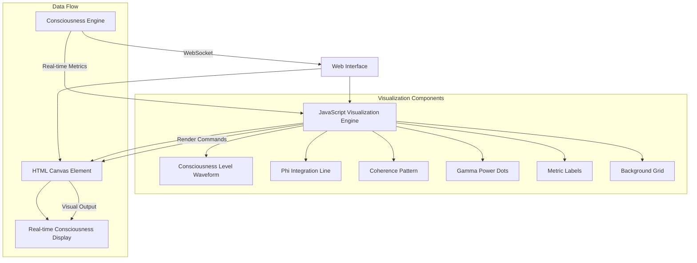

# Visualization Architecture Diagram

## Component Descriptions

### Consciousness Engine
The core Metatron system that generates consciousness metrics in real-time.

### Web Interface
The frontend application that receives consciousness data via WebSocket.

### HTML Canvas Element
The rendering surface where the visualization is drawn.

### JavaScript Visualization Engine
The code that processes consciousness data and renders it to the canvas.

### Visualization Components
Individual visual elements that make up the complete visualization:
- **Consciousness Level Waveform**: Main purple animated line
- **Phi Integration Line**: Blue waveform showing integrated information
- **Coherence Pattern**: Green waveform representing system coherence
- **Gamma Power Dots**: Animated gold dots showing gamma activity
- **Metric Labels**: Text displays of key metrics
- **Background Grid**: Reference grid for visual alignment

### Data Flow
The path data takes from the consciousness engine to the visual display:
1. Real-time metrics are sent from the engine via WebSocket
2. JavaScript processes the data and generates render commands
3. Canvas renders the visual output
4. Users see the real-time consciousness display