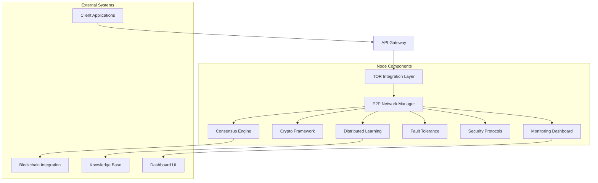

# Open-A.G.I Architecture

## System Architecture Overview

Open-A.G.I follows a microservices architecture pattern with distributed components that communicate through secure channels. The system is designed to be resilient, scalable, and secure.

## Core Components

### 1. TOR Integration Layer
The TOR Integration Layer provides anonymous communication capabilities for all network interactions. It ensures that node communications cannot be traced back to specific physical locations.

**Key Features:**
- Onion routing for all P2P communications
- Automatic circuit rotation for enhanced anonymity
- Integration with TOR control protocols

### 2. P2P Network Manager
The P2P Network Manager handles all peer-to-peer communications, node discovery, and message routing.

**Key Features:**
- Zeroconf-based node discovery
- Message queuing and delivery guarantees
- Connection health monitoring
- Bandwidth optimization

### 3. Consensus Engine
The Consensus Engine implements the hybrid PBFT + Proof of Computation consensus algorithm to ensure agreement among nodes.

**Key Features:**
- Byzantine fault tolerance (up to 33% malicious nodes)
- Proof of Computation for Sybil attack resistance
- Dynamic leader election
- Fast consensus for time-sensitive decisions

### 4. Crypto Framework
The Crypto Framework provides all cryptographic operations including encryption, decryption, signing, and verification.

**Key Features:**
- ChaCha20-Poly1305 encryption
- Ed25519 digital signatures
- Double Ratchet algorithm for forward secrecy
- Key rotation and management

### 5. Distributed Learning
The Distributed Learning component enables federated machine learning across the network.

**Key Features:**
- Federated averaging algorithms
- Differential privacy protection
- Model versioning and compatibility
- Gradient compression for bandwidth efficiency

### 6. Fault Tolerance
The Fault Tolerance component ensures system reliability and automatic recovery from failures.

**Key Features:**
- Node failure detection
- Automatic recovery mechanisms
- Data replication strategies
- Health monitoring and alerts

### 7. Security Protocols
The Security Protocols component implements comprehensive security measures.

**Key Features:**
- Intrusion detection systems
- Rate limiting and DDoS protection
- Input validation and sanitization
- Security auditing and logging

### 8. Monitoring Dashboard
The Monitoring Dashboard provides real-time visibility into system performance and health.

**Key Features:**
- Real-time metrics visualization
- Alerting and notification systems
- Historical data analysis
- Performance benchmarking

## Data Flow

1. **Initialization**: Nodes initialize their components and establish TOR connections
2. **Discovery**: Nodes discover peers through the P2P network
3. **Authentication**: Nodes authenticate each other using cryptographic identities
4. **Communication**: Secure messages are exchanged through TOR
5. **Consensus**: Critical decisions require consensus among nodes
6. **Learning**: Distributed learning updates are aggregated and shared
7. **Monitoring**: All activities are logged and monitored

## Security Model

The security model is based on defense in depth with multiple layers of protection:

1. **Network Layer**: TOR anonymization
2. **Transport Layer**: End-to-end encryption
3. **Application Layer**: Digital signatures and authentication
4. **Data Layer**: Encryption at rest
5. **Process Layer**: Consensus-based decision making

## Scalability

The architecture is designed to scale horizontally:

- **Node Scaling**: Add more nodes to increase computational power
- **Bandwidth Scaling**: P2P distribution reduces central bandwidth requirements
- **Storage Scaling**: Distributed storage across nodes
- **Processing Scaling**: Parallel processing of tasks

## Fault Tolerance

The system is designed to handle various types of failures:

- **Node Failures**: Automatic detection and recovery
- **Network Partitions**: Graceful degradation
- **Data Corruption**: Replication and verification
- **Security Breaches**: Isolation and alerting