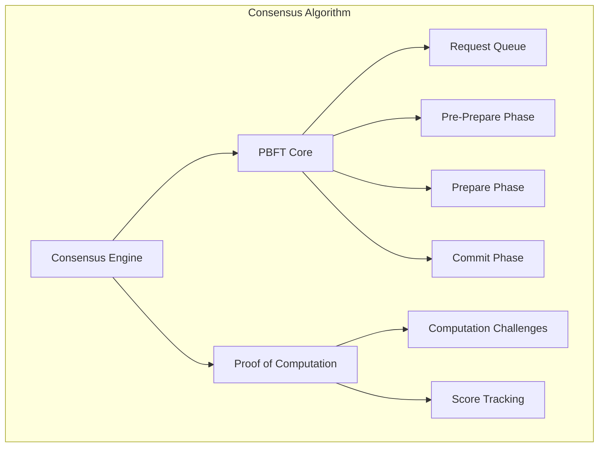

# Consensus Algorithm Component

## Overview

The Consensus Algorithm component implements a hybrid Byzantine fault-tolerant consensus mechanism combining Practical Byzantine Fault Tolerance (PBFT) with Proof of Computation (PoC). This ensures reliable decision-making even in the presence of malicious or faulty nodes.

## Key Features

- **Hybrid Consensus**: PBFT + Proof of Computation for enhanced security
- **Byzantine Fault Tolerance**: Tolerates up to 33% malicious nodes
- **Dynamic Leader Election**: Rotating leadership for decentralization
- **Fast Consensus**: Optimized for quick decision-making
- **Proof of Computation**: Resistance to Sybil attacks

## Architecture



## Usage

### Initializing Consensus Engine

```python
from consensus_algorithm import ConsensusEngine, ConsensusPhase
from cryptography.hazmat.primitives.asymmetric import ed25519

async def initialize_consensus():
    """Initialize consensus engine"""
    # Generate node identity
    private_key = ed25519.Ed25519PrivateKey.generate()
    node_id = "node_123"
    
    # Known nodes in network
    known_nodes = ["node_123", "node_456", "node_789"]
    
    # Create consensus engine
    consensus_engine = ConsensusEngine(
        node_id=node_id,
        known_nodes=known_nodes,
        private_key=private_key
    )
    
    # Start consensus loop
    await consensus_engine.start_consensus_loop()
    
    return consensus_engine
```

### Proposing a Decision

```python
async def propose_decision(consensus_engine, decision_data):
    """Propose a decision for consensus"""
    # Create proposal
    proposal = {
        "proposal_id": f"proposal_{int(time.time())}",
        "proposer": consensus_engine.node_id,
        "data": decision_data,
        "timestamp": time.time()
    }
    
    # Submit proposal
    success = await consensus_engine.submit_proposal(proposal)
    
    if success:
        print("Proposal submitted for consensus")
    else:
        print("Failed to submit proposal")
```

### Handling Consensus Events

```python
async def handle_consensus_decision(decision):
    """Handle consensus decision"""
    print(f"Consensus reached on: {decision['proposal_id']}")
    print(f"Decision: {decision['data']}")
    
    # Execute the decision
    await execute_decision(decision['data'])

# Register consensus handler
consensus_engine.register_decision_handler(handle_consensus_decision)
```

## Configuration

### Consensus Settings

```python
# Consensus Configuration
CONSENSUS_CONFIG = {
    "pbft_timeout": 30,  # seconds
    "poc_interval": 300,  # seconds
    "byzantine_threshold": 0.33,  # 33% tolerance
    "min_computation_score": 50.0,
    "leader_rotation_interval": 600  # seconds
}
```

### Environment Variables

```bash
# Consensus Configuration
PBFT_TIMEOUT=30
POC_INTERVAL=300
BYZANTINE_THRESHOLD=0.33
MIN_COMPUTATION_SCORE=50.0
LEADER_ROTATION_INTERVAL=600
```

## API Reference

### Core Classes

#### `ConsensusEngine`
Main class for managing consensus operations.

**Methods:**
- `start_consensus_loop()`: Start the consensus processing loop
- `stop_consensus_loop()`: Stop the consensus processing loop
- `submit_proposal(proposal)`: Submit a proposal for consensus
- `register_decision_handler(handler)`: Register decision handler
- `get_consensus_status()`: Get current consensus status
- `get_network_stats()`: Get network statistics

#### `PBFTCore`
Implements the Practical Byzantine Fault Tolerance algorithm.

**Methods:**
- `propose_change(change)`: Propose a change to the network
- `handle_pre_prepare(message)`: Handle pre-prepare message
- `handle_prepare(message)`: Handle prepare message
- `handle_commit(message)`: Handle commit message
- `execute_request(request)`: Execute a committed request

#### `ProofOfComputation`
Implements the Proof of Computation mechanism.

**Methods:**
- `generate_challenge()`: Generate computation challenge
- `verify_solution(solution)`: Verify challenge solution
- `update_score(node_id, score)`: Update node computation score
- `get_node_score(node_id)`: Get node computation score

### Consensus Phases

#### `ConsensusPhase`
Enumeration of consensus phases:
- `IDLE`: Waiting for proposals
- `PRE_PREPARE`: Pre-prepare phase
- `PREPARE`: Prepare phase
- `COMMIT`: Commit phase
- `REPLY`: Reply phase

### Message Types

#### `MessageType`
Enumeration of consensus message types:
- `PRE_PREPARE`: Pre-prepare message
- `PREPARE`: Prepare message
- `COMMIT`: Commit message
- `REPLY`: Reply message
- `CHECKPOINT`: Checkpoint message
- `VIEW_CHANGE`: View change message

## Security Considerations

### Byzantine Fault Tolerance
The system can tolerate up to ⌊(n-1)/3⌋ Byzantine failures where n is the total number of nodes.

### Sybil Attack Resistance
Proof of Computation requires computational work to participate, making Sybil attacks expensive.

### Message Authentication
All consensus messages are signed with cryptographic keys to ensure authenticity.

### Replay Attack Prevention
Messages include timestamps and unique identifiers to prevent replay attacks.

## Performance Characteristics

### Consensus Speed
- **Fast Path**: 2 rounds of communication for honest nodes
- **Slow Path**: 4 rounds of communication in worst case
- **Decision Time**: < 5 seconds for typical proposals

### Scalability
- **Node Count**: Supports up to 100 nodes efficiently
- **Message Complexity**: O(n²) messages per request
- **Bandwidth**: Optimized message batching

### Resource Usage
- **Memory**: ~50MB for consensus state
- **CPU**: Moderate during consensus rounds
- **Network**: Efficient message encoding

## Integration with Other Components

### P2P Network
Uses P2P network for consensus message transmission.

### Crypto Framework
Uses cryptographic signatures for message authentication.

### Monitoring Dashboard
Provides consensus metrics and performance statistics.

### Blockchain Integration
Commits consensus decisions to blockchain for immutability.