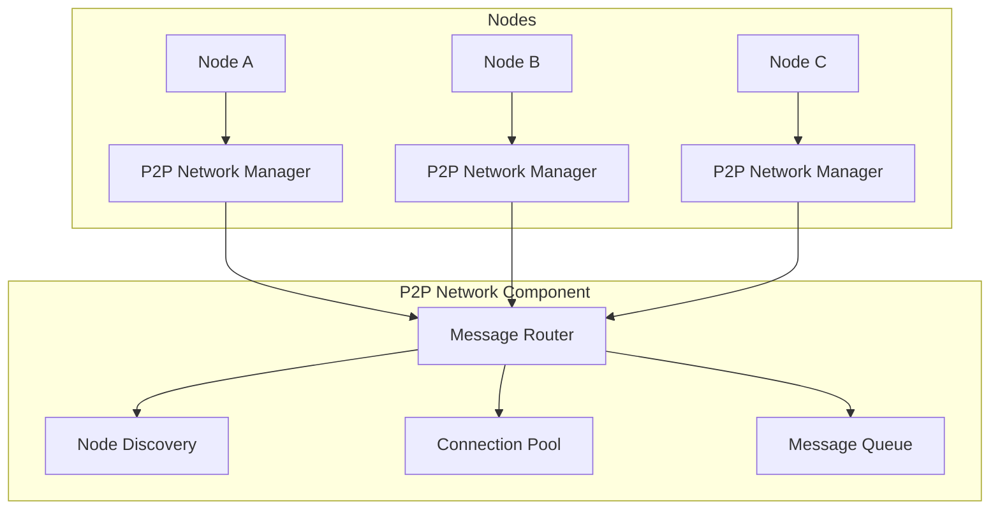

# P2P Network Component

## Overview

The P2P Network component manages peer-to-peer communications between Open-A.G.I nodes. It handles node discovery, message routing, connection management, and network topology maintenance.

## Key Features

- **Zeroconf Discovery**: Automatic node discovery on local networks
- **Message Queuing**: Reliable message delivery with queuing
- **Connection Health Monitoring**: Real-time connection status tracking
- **Bandwidth Optimization**: Efficient data transmission
- **Protocol Support**: Multiple messaging protocols

## Architecture



## Usage

### Initializing P2P Network

```python
from p2p_network import P2PNetworkManager, NodeType

async def initialize_p2p_network():
    """Initialize P2P network manager"""
    # Create network manager
    p2p_manager = P2PNetworkManager(
        node_id="node_123",
        node_type=NodeType.FULL_NODE,
        port=8080
    )
    
    # Start network server
    await p2p_manager.start_server()
    
    # Discover peers
    await p2p_manager.discover_peers()
    
    return p2p_manager
```

### Sending Messages

```python
from p2p_network import NetworkMessage, MessageType

async def send_message(p2p_manager, recipient_id, content):
    """Send a message to another node"""
    # Create message
    message = NetworkMessage(
        message_id="msg_001",
        sender_id=p2p_manager.node_id,
        recipient_id=recipient_id,
        message_type=MessageType.DATA,
        payload=content,
        timestamp=time.time()
    )
    
    # Send message
    success = await p2p_manager.send_message(message, recipient_id)
    
    if success:
        print("Message sent successfully")
    else:
        print("Failed to send message")
```

### Receiving Messages

```python
async def handle_incoming_message(message):
    """Handle incoming messages"""
    print(f"Received message from {message.sender_id}: {message.payload}")
    
    # Process message based on type
    if message.message_type == MessageType.DATA:
        await process_data_message(message)
    elif message.message_type == MessageType.HEARTBEAT:
        await process_heartbeat(message)
    elif message.message_type == MessageType.CONSENSUS:
        await process_consensus_message(message)

# Register message handler
p2p_manager.register_message_handler(handle_incoming_message)
```

## Configuration

### Network Settings

```python
# P2P Network Configuration
P2P_CONFIG = {
    "discovery": "zeroconf",  # or "manual"
    "heartbeat_interval": 30,  # seconds
    "max_connections": 50,
    "message_timeout": 60,  # seconds
    "retry_attempts": 3,
    "bandwidth_limit": 1048576  # 1MB/s
}
```

### Environment Variables

```bash
# P2P Network Configuration
P2P_DISCOVERY_METHOD=zeroconf
P2P_HEARTBEAT_INTERVAL=30
P2P_MAX_CONNECTIONS=50
P2P_MESSAGE_TIMEOUT=60
```

## API Reference

### Core Classes

#### `P2PNetworkManager`
Main class for managing P2P network operations.

**Methods:**
- `start_server()`: Start P2P network server
- `stop_server()`: Stop P2P network server
- `discover_peers()`: Discover other nodes on network
- `send_message(message, recipient)`: Send message to recipient
- `register_message_handler(handler)`: Register message handler
- `get_peer_info(peer_id)`: Get information about a peer
- `get_network_stats()`: Get network statistics

#### `NetworkMessage`
Represents a message in the P2P network.

**Attributes:**
- `message_id`: Unique message identifier
- `sender_id`: Sender node ID
- `recipient_id`: Recipient node ID
- `message_type`: Type of message
- `payload`: Message content
- `timestamp`: Message creation time
- `ttl`: Time to live

#### `MessageType`
Enumeration of message types:
- `DATA`: General data message
- `HEARTBEAT`: Node health check
- `CONSENSUS`: Consensus-related message
- `DISCOVERY`: Node discovery message
- `ERROR`: Error message

### Message Handling

#### `register_message_handler(handler)`
Register a function to handle incoming messages.

**Parameters:**
- `handler`: Async function that takes a NetworkMessage parameter

#### `send_message(message, recipient)`
Send a message to a specific recipient.

**Parameters:**
- `message`: NetworkMessage instance
- `recipient`: Recipient node ID

**Returns:**
- Boolean indicating success

## Security Considerations

### Message Authentication
All messages are signed with cryptographic keys to ensure authenticity.

### Connection Security
Connections are encrypted using the Crypto Framework.

### Rate Limiting
Built-in rate limiting prevents message flooding attacks.

### Input Validation
All incoming messages are validated to prevent injection attacks.

## Performance Characteristics

### Scalability
- Supports up to 1000 concurrent connections
- Efficient message routing algorithms
- Load balancing across connections

### Latency
- Message delivery: < 100ms in local networks
- Cross-network: Depends on TOR integration

### Bandwidth
- Message overhead: ~50 bytes per message
- Compression: Automatic compression for large payloads

### Resource Usage
- Memory: ~10MB per 100 active connections
- CPU: Minimal overhead for message processing

## Integration with Other Components

### TOR Integration
Uses TOR for anonymous message transmission when enabled.

### Consensus Algorithm
Transports consensus messages between nodes.

### Monitoring Dashboard
Provides network statistics and connection metrics.

### Fault Tolerance
Reports connection failures and network issues.