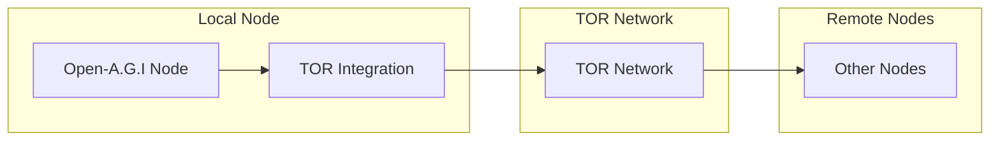

# TOR Integration Component

## Overview

The TOR Integration component provides anonymous communication capabilities for the Open-A.G.I system. It enables nodes to communicate securely without revealing their physical locations or identities.

## Key Features

- **Onion Routing**: All communications are routed through the TOR network
- **Automatic Circuit Management**: Dynamic circuit creation and rotation
- **Service Discovery**: Hidden service creation for node accessibility
- **Security Level Configuration**: Adjustable security settings

## Architecture



## Usage

### Initializing TOR Gateway

```python
from tor_integration import create_secure_tor_gateway, SecurityLevel

async def initialize_tor():
    # Create TOR gateway with high security
    tor_gateway = await create_secure_tor_gateway(SecurityLevel.HIGH)
    
    # Create hidden service for node communication
    onion_address = await tor_gateway.create_onion_service(8080)
    print(f"Node accessible at: {onion_address}")
    
    return tor_gateway
```

### Sending Anonymous Messages

```python
async def send_anonymous_message(tor_gateway, destination, message):
    """Send a message through TOR network"""
    try:
        # Establish secure connection through TOR
        connection = await tor_gateway.create_connection(destination)
        
        # Send encrypted message
        await connection.send(message)
        
        # Close connection
        await connection.close()
        
        return True
    except Exception as e:
        print(f"Error sending message: {e}")
        return False
```

## Configuration

### Security Levels

The TOR Integration component supports three security levels:

1. **STANDARD**: Basic TOR protection
2. **HIGH**: Enhanced security with longer circuits
3. **PARANOID**: Maximum security with frequent circuit rotation

### Environment Variables

```bash
# TOR Configuration
TOR_CONTROL_PORT=9051
TOR_SOCKS_PORT=9050
TOR_SECURITY_LEVEL=HIGH
TOR_CIRCUIT_ROTATION_INTERVAL=300
```

## API Reference

### Core Functions

#### `create_secure_tor_gateway(security_level)`
Creates a secure TOR gateway with specified security level.

**Parameters:**
- `security_level`: SecurityLevel enum (STANDARD, HIGH, PARANOID)

**Returns:**
- TOR gateway instance

#### `TorGateway.create_onion_service(port)`
Creates a hidden service for node accessibility.

**Parameters:**
- `port`: Local port to expose through hidden service

**Returns:**
- Onion address string

#### `TorGateway.create_connection(destination)`
Creates a secure connection to a destination through TOR.

**Parameters:**
- `destination`: Destination onion address

**Returns:**
- Secure connection instance

## Security Considerations

### Threat Mitigation

1. **Traffic Analysis**: TOR network obscures communication patterns
2. **Location Privacy**: Physical locations are not revealed
3. **Identity Protection**: Cryptographic identities are used instead of real identities
4. **Man-in-the-Middle Attacks**: All communications are encrypted

### Best Practices

1. **Regular Circuit Rotation**: Rotate circuits periodically to enhance anonymity
2. **Minimize Metadata**: Avoid revealing unnecessary information in communications
3. **Monitor Bandwidth**: Be aware of bandwidth usage patterns
4. **Update TOR**: Keep TOR software updated for security patches

## Performance Characteristics

### Latency
- **Connection Setup**: 5-15 seconds for circuit establishment
- **Message Transmission**: Additional 100-500ms compared to direct connections

### Bandwidth
- **Overhead**: 20-30% bandwidth overhead due to TOR routing
- **Compression**: Built-in compression to minimize overhead

### Resource Usage
- **Memory**: 50-100MB additional memory for TOR processes
- **CPU**: Minimal CPU overhead for encryption/decryption

## Integration with Other Components

### P2P Network
The TOR Integration component serves as the transport layer for the P2P Network component, providing anonymous communication channels between nodes.

### Crypto Framework
Works in conjunction with the Crypto Framework to provide end-to-end encryption over TOR connections.

### Monitoring Dashboard
Provides metrics on TOR network status, circuit health, and bandwidth usage.